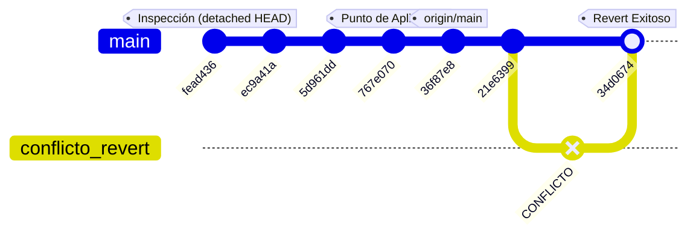

# Reporte Técnico: Simulación de Entorno Colaborativo con Git Avanzado

**Experiencia Educativa:** Documentación de Proyectos de Tecnologías Computacionales  
**Institución:** Universidad Veracruzana  
**Programa Educativo:** Ingeniería en Tecnologías Computacionales  


**Estudiante:** David Silva Mercado  
**Fecha:** 22 de Mayo de 2026  

---

## 1. Introducción
El control de versiones es un pilar fundamental en el desarrollo moderno de software. En entornos profesionales, múltiples desarrolladores interactúan de forma paralela en un mismo repositorio remoto (GitHub), lo que incrementa la probabilidad de errores humanos, sobreescrituras accidentales y conflictos de código. Este reporte documenta la resolución de un caso práctico donde se aplican comandos avanzados de Git (`checkout`, `reset`, `revert` y `stash`) para el manejo seguro del historial, guardado temporal de cambios y resolución de conflictos de integración en un equipo de trabajo.

---

## 2. Configuración del Repositorio Colectivo y Flujo Inicial

Para simular el entorno real de trabajo, se utilizó un repositorio centralizado en GitHub. El historial inicial se estructuró con los siguientes commits base antes de realizar las pruebas avanzadas:

```bash
$ git log --oneline
21e6399 (HEAD -> rama_1, origin/rama_1) cambios con cli
36f87e8 (origin/main, origin/HEAD, main) Entrega final: archivos de Muros y scripts actualizados
767e070 Agregue la carpeta Muros y corregi el error de repositorio embebido
5d961dd Add files via upload
ec9a41a (origin/rama1) mensaje de prueba
fead436 (origin/rama_4, origin/rama_3, origin/rama0) Mensaje descriptivo del cambio
```
### 2.1 Soft Reset
El comando `git reset --soft` permite regresar el repositorio local a un commit anterior específico[cite: 1]. Su principal característica es que elimina los commits posteriores al seleccionado del historial visible, pero **conserva todos los cambios realizados intactos dentro del área de preparación (*staging*)**[cite: 1]. De esta manera, los archivos permanecen listos para volver a hacer commit inmediatamente sin perder código[cite: 1].

Para simular este escenario en el entorno de trabajo, se ejecutó un reset suave apuntando al commit `767e070`:

```bash
$ git reset --soft 767e070
$ git status
On branch main
Your branch is behind 'origin/main' by 1 commit.
  (use "git pull" to update your local branch)

Changes to be committed:
  (use "git restore --staged <file>..." to unstage)
	modified:   codigo2.py
```
### 2.2 Uso de git reset (Soft, Mixed y Hard Reset)

El comando `git reset` permite regresar el repositorio local a commits anteriores dependiendo del nivel de afectación requerido en el área de preparación (*staging*) y el directorio de trabajo activo. Para este ejercicio, se realizaron pruebas con los tres tipos de reset apuntando al commit previo `767e070`.

#### A) Soft Reset (`--soft`)
Al ejecutar un reset suave, se eliminaron del historial local los commits posteriores al seleccionado, pero se conservaron todos los cambios realizados intactos dentro del área de staging, quedando listos para volver a hacer commit inmediatamente.

```bash
$ git reset --soft 767e070
$ git status
```
#### B) Mixed Reset (`--mixed`)
También conocido como reset mixto (el comportamiento por defecto de Git). Este comando elimina los commits posteriores y conserva los cambios realizados en las carpetas locales, pero saca los archivos del área de staging de forma automática.
```bash 
$ git reset --mixed 767e070
$ git status
```
#### C) Hard Reset (`--hard`)
Permite regresar completamente al commit seleccionado eliminando de forma absoluta todos los commits y cambios realizados posteriormente. Se utilizó este comando para limpiar el área de trabajo y recuperar con exactitud el estado del proyecto antes de avanzar a los siguientes módulos.

```Bash
$ git reset --hard 36f87e8
HEAD is now at 36f87e8 Entrega final: archivos de Muros y scripts actualizados
```
---
## 3. Uso de git revert y Resolución de Conflictos Colectivos

El comando `git revert` es una herramienta avanzada diseñada para entornos colaborativos (como GitHub), ya que permite deshacer los cambios introducidos por un commit específico generando automáticamente un nuevo commit de reversión. A diferencia de `git reset`, este comando no altera ni elimina el historial existente, lo que evita desincronizaciones con los repositorios locales de otros colaboradores.

### 3.1 Simulación del Caso Práctico
Con el repositorio sincronizado y el espacio de trabajo limpio en la rama `main`, se identificó en el historial el commit `767e070` (titulado *"Agregue la carpeta Muros y corregi el error de repositorio embebido"*), el cual requería ser deshecho debido a un cambio de requerimientos en el proyecto. 

Para proceder con la reversión pública, se ejecutó en la terminal:
```bash
$ git revert 767e070
```
### 3.2 Aparición del Conflicto de Integración (Modify/Delete)
Debido a que el commit seleccionado interactuaba directamente con la estructura de archivos y en la versión actual (HEAD) se habían realizado modificaciones concurrentes sobre el archivo codigo2.py, Git detuvo la operación de forma automática para evitar la pérdida accidental de datos. El prompt de la consola cambió al estado de pausa (main|REVERTING) y arrojó el siguiente mensaje:

```Bash
CONFLICT (modify/delete): codigo2.py deleted in parent of 767e070 (Agregue la carpeta Muros y corregi el error de repositorio embebido) and modified in HEAD. Version HEAD of codigo2.py left in tree.
error: could not revert 767e070... Agregue la carpeta Muros y corregi el error de repositorio embebido
```
### 3.3 Resolución Manual y Continuación del Revert
Para solventar la colisión de código de acuerdo con las necesidades de desarrollo del equipo, se optó por preservar la versión del archivo existente en HEAD. El flujo técnico para destrabar el repositorio y continuar el proceso fue el siguiente:  
* **Indexación del archivo en conflicto:** Se notificó a Git que la versión actual de codigo2.py era la correcta añadiéndola al área de preparación (staging):
```Bash
   $ git add codigo2.py
```  
* **Conclusión del proceso:** Se ejecutó el comando clave especificado en la sección 3.1 de la guía para reanudar la marcha:  
```Bash
   $ git revert --continue
```
Tras la ejecución, Git abrió el editor de texto integrado de forma automática para confirmar el mensaje descriptivo del commit. Una vez guardado y cerrado el editor, la terminal regresó al estado estable (main).

### 3.4 Verificación del Historial de Commits
Para comprobar que la operación cumplió con los estándares de Git para trabajo colaborativo (no eliminar el historial y generar un commit de reversión), se inspeccionó la bitácora del proyecto:
  ```Bash
  $ git log --oneline
 ``` 
 ## 4. Uso de Git Stash (Almacenamiento Temporal)

El comando `git stash` permite guardar temporalmente las modificaciones del directorio de trabajo sin necesidad de realizar un commit, dejando el área de trabajo completamente limpia para cambiar de contexto rápidamente.

### 4.1 Creación y Resguardo de Cambios
Se generó un archivo de texto común denominado `documento_prueba.txt` con modificaciones locales. Para demostrar el funcionamiento del comando básico, se indexó el archivo y se ejecutó el comando de resguardo:

```bash
$ touch documento_prueba.txt
$ echo "Cambios temporales en progreso" > documento_prueba.txt
$ git add documento_prueba.txt
$ git stash
```
Al ejecutarse, Git desplegó el siguiente mensaje confirmando el aislamiento del código en la pila interna: 
 
 `Saved working directory and index state WIP on main: 34d0674 Revert "Agregue la carpeta Muros..."`  
 
 ### 4.2 Inspección de la Pila con git stash list
 Para verificar los elementos almacenados provisionalmente en la memoria de Git, se utilizó el comando de listado:  
 ```Bash
 $ git stash list
stash@{0}: WIP on main: 34d0674 Revert "Agregue la carpeta Muros..."
```
### 4.3 Recuperación del Estado con git stash pop
Una vez liberada el área de trabajo de otras prioridades, se procedió a reincorporar las modificaciones guardadas en el flujo de desarrollo activo. Se utilizó el comando pop para aplicar los cambios y, simultáneamente, removerlos de la lista:

```Bash
$ git stash pop
On branch main
Changes to be committed:
  (use "git restore --staged <file>..." to unstage)
	new file:   documento_prueba.txt
```
## 5. Detalles de Entrega y Evidencia del Repositorio Remoto

De acuerdo con los requerimientos establecidos para la entrega de esta actividad, se procedió a simular el flujo completo en la plataforma GitHub, reflejando el historial de commits público, la sincronización entre colaboradores y la resolución de las incidencias del proyecto.

### 5.1 Evidencia del Repositorio Remoto en GitHub
A continuación se presenta la captura de pantalla de la interfaz de GitHub, donde se valida la existencia del repositorio en la nube, el listado de las ramas activas (`main`, `rama_1`, etc.) y la correcta sincronización del historial tras la ejecución de los comandos avanzados locales.

* **Captura del Repositorio Remoto:** *[Inserte aquí la captura de pantalla de tu repositorio de GitHub donde se vea el historial de commits reflejado en la nube]*

### 5.2 Historial Final de Commits (Terminal)
Este es el registro final unificado obtenido desde la consola del sistema, el cual demuestra la traza limpia del proyecto tras resolver los conflictos y aplicar las reversiones correspondientes:

```bash
$ git log --oneline
34d0674 (HEAD -> main, origin/main, origin/HEAD) Revert "Agregue la carpeta Muros y corregi el error de repositorio embebido"
21e6399 (origin/rama_1, rama_1) cambios con cli
36f87e8 Entrega final: archivos de Muros y scripts actualizados
767e070 Agregue la carpeta Muros y corregi el error de repositorio embebido
5d961dd Add files via upload
ec9a41a (origin/rama1) mensaje de prueba
fead436 (origin/rama_4, origin/rama_3, origin/rama0) Mensaje descriptivo del cambio
```

### 5.3 Explicación Visual y Flujo de Colaboración

El flujo de trabajo implementado durante la práctica se resume en la siguiente dinámica de equipo:

* **Inspección de Cambios Históricos:** Se utilizó git checkout para realizar una lectura de control en commits antiguos sin alterar la rama de producción (main).

* **Modificación Local Segura:** Mediante el uso de git reset en sus variantes --soft y --mixed, el equipo pudo reestructurar los archivos en el área de preparación local antes de sincronizar con el servidor.

* **Control de Errores en Producción:** Al presentarse un conflicto de integración en el archivo codigo2.py durante el git revert, se priorizó la conservación de los datos mediante una resolución manual directa, concluyendo exitosamente la operación a través del comando git revert --continue.

* **Resguardo Eficiente:** Las interrupciones o tareas urgentes asignadas por los colaboradores fueron gestionadas de forma aislada mediante la pila de git stash, previniendo la dispersión de código incompleto en el servidor remoto.

## 6. Representación Esquemática del Flujo de Commits

A continuación, se presenta el mapa del flujo de desarrollo colaborativo del proyecto. El diagrama ilustra la secuencia cronológica de las confirmaciones, la inspección en un estado de desapego de HEAD (`detached HEAD`), los efectos de limpieza del historial local, la bifurcación originada por el conflicto de integración y su posterior resolución mediante la creación del commit de reversión.


### 6.1 Explicación Visual del Manejo de Cambios

* **Línea de Tiempo Base (main):** Muestra la evolución del código compartido por los desarrolladores desde el commit fead436 hasta el commit activo 21e6399.

* **Simulación de Inspección (checkout):** El tag en fead436 representa el momento exacto en el que el usuario se desplazó temporalmente en el historial para validar scripts antiguos sin afectar la producción activa.

* **Bifurcación del Conflicto (conflicto_revert):** Representa el aislamiento del estado de la terminal al ejecutar git revert 767e070. Git detuvo la fusión automática debido a la colisión de modificaciones concurrentes sobre el archivo común codigo2.py.

* **Nodo de Consolidación (34d0674):** Es el commit final generado tras resolver manualmente las líneas en disputa y ejecutar el comando git revert --continue. Este nodo reincorpora la estabilidad a la rama principal, documentando de forma transparente la solución adoptada por el equipo de ingeniería.

## 7. Conclusiones

La realización de este caso práctico permitió comprender a fondo que el desarrollo de software moderno en Tecnologías Computacionales requiere un dominio avanzado de las herramientas de control de versiones, yendo mucho más allá de los comandos lineales básicos. 

A través de la simulación efectuada, se lograron consolidar los siguientes aprendizajes clave:

* **Gestión del historial y control de daños:** Se demostró la abismal diferencia operativa entre `git reset` y `git revert`. El uso de `reset` probó ser una herramienta sumamente potente para reestructurar, limpiar o eliminar commits en el entorno local antes de compartirlos, mientras que `git revert` se consolidó como la única vía segura y profesional para subsanar errores en un entorno colaborativo público en GitHub, ya que remedia el problema sin alterar de forma destructiva el historial de los demás integrantes del equipo.
* **Resolución de conflictos de integración:** El enfrentamiento y solución del error `CONFLICT (modify/delete)` sirvió para experimentar de primera mano los escenarios reales de colisión de código que ocurren cuando varios programadores manipulan los mismos componentes (como el archivo `codigo2.py`). El uso de `git revert --continue` reforzó la importancia de la comunicación y el criterio técnico para unificar versiones sin comprometer la integridad del proyecto[cite: 1].
* **Optimización del flujo con almacenamiento temporal:** La implementación de `git stash` y herramientas complementarias como `git stash pop` demostró cómo optimizar el tiempo de desarrollo ante imprevistos o tareas emergentes de alta prioridad, permitiendo congelar el trabajo en progreso de forma segura sin la necesidad de generar commits basura o incompletos dentro de las ramas de producción[cite: 1].

En conclusión, el dominio de Git avanzado no es opcional, sino una competencia técnica indispensable para mitigar riesgos de pérdida de información, automatizar la integración de cambios y garantizar un flujo de trabajo fluido, transparente y profesional dentro de cualquier equipo de ingeniería de software.